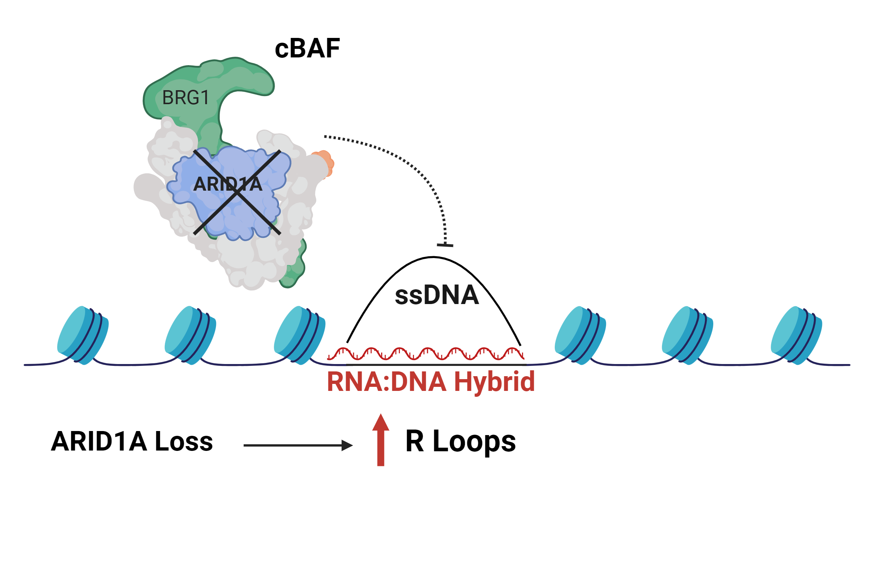

<style>
.tocify {
  font-size: 11pt;
}

.tocify-header .tocify-item {
  font-size: 0.90em;
  padding-left: 25px;
  text-indent: 0;
}

.tocify .list-group-item {
@@ -358,7 +359,6 @@
}
.tocify-subheader .tocify-item {
  font-size: 0.95em;
}
$endif$

p.caption {
  font-size: 1.25em;
  color: black
}

pre {
  overflow-x: scroll
}

pre code {
  white-space: pre;
}

body {
  font-size: 12pt;
}

</style>


```{r setup, include=FALSE}
knitr::opts_chunk$set(echo = TRUE)
knitr::opts_chunk$set(warning = FALSE)
knitr::opts_chunk$set(message = FALSE)
```

Load packages and set working directory
```{r}
if (!require("pacman")) install.packages("pacman")
pacman::p_load(here,  
               tidyverse, #dyplyr and ggplot utilities
               ggrepel, # Optimize plot label separation 
               forcats, #Package for working with factors
               msigdbr, #Molecular signatures database package 
               clusterProfiler, #Package for ORA analysis
               org.Hs.eg.db, #human genome annotations
               ReactomePA) #Reactome pathways package for ORA analysis

wd <- r"(C:\Users\mattm\OneDrive\Desktop\Hargreaves_Lab\Public_Data_analysis\DepMap\Maxwell_et_al_Figs)"
setwd(wd)
```


**Import data **
```{r}
library(readxl)
RNAi <- read_excel("RNAi_DepMap_Portal_Diff_Means_4_17_24.xlsx")

```

## **DepMap Analysis of *ARID1A* mutant RNAi Genetic Dependencies (Figure S7L)**
Below I'm including steps to download *ARID1A* mutant RNAi genetic dependencies data from DepMap:
1) Navigate to  https://depmap.org/portal/
2) select "Tools" tab > custom analysis > Two Class Comparison
3) Upload list of *ARID1A* mutant DepMap cell lines (n=222) included in this repo ("ARID1A_Mutant_Cell_Lines_DepMap_ID.csv)
4) Select "RNAi (Achilles+DRIVE+Marcotte,DEMETER2)" under Portal data
5) Use all other cell lines for out group > Run
6) Download all 16810 rows of results table for further analysis

Plot effect size (difference of mean dependency values) vs Q-values for the nearly ~17,000 genes in the DepMap RNAi screening data. There are nine genes that are classified as *ARID1A* mutant cancer dependencies classified by their differential dropout in the RNAi screens compared to non-mutant cancer cell lines. **The paralog of *ARID1A*, ARID1B is the most significant dependency in *ARID1A* mutant cancer cell lines which I'm highlighting here as a positive control to ensure the analysis gives reasonable results.**
```{r RNAi volcano_plot, fig.height=6, message=FALSE}
#Read in RNAia from the previous code chunk run on high performance computing cluster

RNAi <- RNAi %>%
  mutate(log10q = -log10(QValue))

#Add a new column using dplyr package defining genes as 
# 1) Not significant (NS)
# 2) ARID1A mutant dependency (ARID1A mutant is sensitive to gene knockdown)
# 3) or a non-mutant dependency (ARID1A mutant is resistant to gene knockdown)
RNAi <- RNAi %>%
  mutate(gene_type = case_when(QValue < .05 & EffectSize <= -0.1 ~ "ARID1A_Mutant_Dependency",
                               QValue < .05 & EffectSize >= 0.1 ~ "Non-mutant_Dependency",
                               TRUE ~ "NS"))

RNAi <- RNAi %>%
  mutate(log10q = -log10(QValue))

#Specify colors, sizes, and transparancy values associated with the three classes of genes for volcano plot
cols <- c("ARID1A_Mutant_Dependency" = "red", "Non-mutant_Dependency" = "#26b3ff", "NS" = "grey")
sizes <- c("ARID1A_Mutant_Dependency" = 2, "Non-mutant_Dependency" = 2, "NS" = 1) 

#Genes for labeling on volcano plot
label_genes <- RNAi %>%
  filter(label %in% c("ARID1B", "WRN", "DDX27", "SRSF1", "PNO1"))


#Output plot of effect size vs Log10P value
volcano_deps <- ggplot(RNAi, aes(EffectSize,log10q)) + 
      geom_point(aes(colour = gene_type),
             alpha = .6,
             shape = 16,
             size = 4) + 
  geom_hline(yintercept = 1.3, linetype = "dashed") +
  geom_vline(xintercept = -0.1,
             linetype = "dashed") +
  geom_label_repel(data = label_genes,
                   aes(label = label),
                   force = 3,
                   nudge_y = 1.5) +
  scale_colour_manual(values = cols) + 
  ggtitle(substitute(paste(bold("ARID1A Mutant Cancer Genetic Dependencies (RNAi)")))) +
  labs(x = "Difference of Mean Depenency", y = "-Log10 Q-value", colour = "Legend") +
  theme_classic() +
  theme(plot.title = element_text(hjust = 0.5, size = 15)) +
  theme(axis.text = element_text(size = 10, color = "black"), axis.title.x = element_text(size = 14), axis.title.y = element_text(size = 14))

volcano_deps
#save plot
ggsave("RNAi_volcano_plot.pdf",height=5.5,width=8,units="in")  
```

## **Pathway Over-Representation Analysis (ORA) of *ARID1A* Mutant Dependencies**
To get an idea of the pathways that are enriched within the 9 *ARID1A* mutant dependency genes, we can perform pathway over-representation analysis (ORA) against Reactome Pathways gene sets using the [ReactomePA](https://bioc.ism.ac.jp/packages/3.11/bioc/vignettes/ReactomePA/inst/doc/ReactomePA.html) package. This analysis highlights the role of genes invovled in RNA metabolism which could be promising drug targets in *ARID1A* mutant cancers. 
```{r ORA_analysis, fig.cap = "**Figure 2: ORA Analysis of ARID1A Mutant Cancer Genetic Dependencies**", fig.height=5.5, message=FALSE}
#Grab the genes we categorized as ARID1A dependencies (n=102) using dplyr filter function
ARID1A_Deps <- RNAi%>%
  filter(gene_type %in% "ARID1A_Mutant_Dependency")

#Need to grab just the gene name column for Gene Symbol to Entrez ID conversion
ARID1A_Deps <- ARID1A_Deps$label

#Add Entrez IDs to Gene IDs df using bitr function from ClusterProfiler package
Entrez_ID <- bitr(ARID1A_Deps, fromType="SYMBOL", toType="ENTREZID", OrgDb="org.Hs.eg.db")

#Make Entrez IDs into a matrix for the enrichpathway command
de <- Entrez_ID$ENTREZID

#Need to get gene overlap with datasets and significance value w Reactome datasets
#enrichPathway function is from the ReactomePA package
x <- enrichPathway(gene = de, pvalueCutoff = .05, readable = TRUE, maxGSSize = 1500, minGSSize = 3)
head(x)

#Grab enrichPathway results from our S4 results object.
ReactomePathways <- x@result

#Function to convert fractions to decimals
convert_fraction_to_proportion <- function(fraction) {
  fraction_parts <- strsplit(fraction, "/")[[1]]
  numerator <- as.numeric(fraction_parts[1])
  denominator <- as.numeric(fraction_parts[2])
  
  proportion <- numerator / denominator
  return(proportion)
}

#Convert fractions in GeneRatio column to decimal proportions
ReactomePathways$GeneRatio <- apply(ReactomePathways, 1, function(row) convert_fraction_to_proportion(row["GeneRatio"]))

#Remove duplicate Reactome entries in the description column
ReactomePathways <- ReactomePathways[!duplicated(ReactomePathways$Description), ]
ReactomePathways <- ReactomePathways[!duplicated(ReactomePathways$Description), , drop = FALSE]

#Grab the top pathways in ORA Reactome
Top_pathways <- slice_max(ReactomePathways, order_by = GeneRatio, n=5)
rownames(Top_pathways) <- Top_pathways$Description

# #select non-redundant top reactome pathways
# Top_pathways <- Top_pathways %>%
#   filter(row.names(.) %in% c("Metabolism of RNA", "RNA Polymerase II Transcription",
#                              "rRNA processing", "mRNA Splicing", "Processing of Capped Intron-Containing Pre-mRNA"))

#Make Reactome Enrichments plot
custom_dotplot <- ggplot(Top_pathways, aes(x = GeneRatio, y = fct_reorder(Description, GeneRatio))) + 
  geom_point(aes(size = GeneRatio, color = p.adjust)) +
  theme_minimal(base_size = 14) +
  #scale_colour_viridis_c(limits = c(5.0e-06, 2.5e-05). direction = 1, option = "viridis")+
  ylab(NULL) +
  #ggtitle("Hallmark enrichment", ) +
   scale_colour_gradient(limits=c(7.553705e-15, 0.15), low="red", high = "blue")  + coord_cartesian(clip = "off") +
   scale_size_continuous(range = c(5, 15)) +
  labs(color="adjusted p-value", size="GeneRatio") + 
  ggtitle(substitute(paste(bold("Pathway ORA ARID1A Mutant Deps")))) +
  theme(axis.text=element_text(size=10,color="black")) +
    theme(plot.title = element_text(hjust = 0.5, size = 15)) 
custom_dotplot
```

**Are *ARID1A* Mutant Cancers Synthetic Lethal with R-Loop Regulators?**
The above ORA analysis reveals a prominent enrichment of RNA Metabolism and transcription pathways. Several of the genes in these RNA metabolism and transcription pathways are involved in the resolution of RNA:DNA hybrid structures called "R-Loops" which are a product of transcriptional stalling and DNA replication stress and can result in genotoxic double stranded breaks and apoptosis if unresolved. 
```{r echo=FALSE, out.width = "100%", fig.align = "center"}

# C:\Users\mattm\OneDrive\Desktop\GitHub_projects\DepMap
# ARID1A_B_Synthetic_Lethality_Graphic```
```

## **R-loop regulators are enriched among *ARID1A* Mutant Dependencies (Figure S7M)**
To test if R-Loop regulator genes are over-represented among the 9 *ARID1A* mutant dependency genes, I used a reference list of putative R-Loop regulators from a resource called [R-Loop Base](https://academic.oup.com/nar/article/50/D1/D303/6430826) plus SWI/SNF (BAF) complex subunits (we and others discovered a role for SWI/SNF in R-loop resolution) compared to the ~17,000 non dependency genes as a background list. 
```{r Fisher T test, fig.height=8}

#Read in R-Loop genes list
#This list is from R-Loop Base publication.
r_loop_human_genes <- read.delim("human_R_loop_regulators.txt")
r_loop_human_genes <- data.frame(Gene = r_loop_human_genes$Description)
#Read in BAF genes
baf_genes <- read.delim("List_of_BAF_genes.txt")

#combine R-loop base and BAF genes
r_loop_genes <- rbind(r_loop_human_genes, baf_genes)

#Add a new column using dplyr mutate function to classify genes as R-Loop regulators or not using dplyr mutate function
RNAi <- RNAi %>%
  mutate(gene_class = case_when(RNAi$label %in% r_loop_genes$Gene ~ "R-loop regulator",
                                #RNAi$Gene %in% BAF$Human_gene ~ "SWI-SNF subunit", 
                                #RNAi$Gene %in% IFN_related_genes$Gene ~ "IFN-related",
                                TRUE ~ "Non R-loop regulator"))

#Filter for ARID1A Mutant Deps containing the gene_class column using dplyr filter function
ARID1A_Deps <- RNAi %>%
  filter(gene_type %in% c("ARID1A_Mutant_Dependency"))

#Filter for Non-Mutant Deps using dplyr filter function
non_deps <- RNAi %>%
  filter(gene_type %in% "NS")

#Make gene_class a factor rather than a character for subsequent count function (can't count characters)
ARID1A_Deps$gene_class <- as.factor(ARID1A_Deps$gene_class)

#Count number of R-Loop regulators in ARID1A Deps
ARID1A_dep_counts <- ARID1A_Deps %>%
  count(gene_class) %>%
  arrange(desc(n)) %>%
  mutate(Fraction_of_dataset = n/sum(n))

#Count number of R-Loop regulators in Non-mutant Deps
Non_significant_counts <- non_deps %>%
  count(gene_class) %>%
  arrange(desc(n)) %>%
  mutate(Fraction_of_dataset = n/sum(n))


# Set the factor levels in the desired order
ARID1A_dep_counts$gene_class <- factor(ARID1A_dep_counts$gene_class, levels = unique(ARID1A_dep_counts$gene_class))  

Non_significant_counts <- non_deps %>%
  count(gene_class) %>%
  arrange(desc(n)) %>%
  mutate(Fraction_of_dataset = n/sum(n))

#Make data frame for statistical tests
test_dat <- data.frame(Group = c("ARID1A Mutant Dependencies", "Non Dependency"),
                   R_loop_regulator = c(7, 2),
                   non_r_loop = c(1131, 15670))

# Perform the Fisher's exact test
fisher_result <- fisher.test(test_dat[, c("R_loop_regulator", "non_r_loop")])
fisher_result

# Set the factor levels in the desired order
Non_significant_counts$gene_class <- factor(Non_significant_counts$gene_class, levels = unique(Non_significant_counts$gene_class))  

barplot_dat <- data.frame(
  group = rep(c("ARID1A Mutant Dependencies", "Non Dependency"), each = 2),
  Legend = rep(c("R-loop regulators", "Non R-loop regulators"), times = 2),
  proportion = c(0.7777778, 0.2222222, 0.06731742, 0.93268258)
)

# For cats command to reverse order of groups on ggplot
barplot_dat$group <- fct_rev(barplot_dat$group)


barplot <- ggplot(barplot_dat, aes(x = group, y = proportion, fill = Legend)) +
  geom_bar(stat = "identity", position = "stack") +
  scale_fill_manual(values = c("black", "red")) +
  coord_cartesian(clip = "off") +
  theme_minimal(base_size = 15) +
  ylab("Proportion of group") +
  xlab(NULL) +
  ggtitle(substitute(paste(bold("Fisher Test for R-Loop Regulators")))) +
  theme_classic() +
  theme(axis.title.y = element_text(size = 14)) +
  theme(axis.text = element_text(size = 12, color = "black")) +
  theme(axis.text.x = element_text(size = 12, angle = 45, hjust = 1),
        plot.title = element_text(size =18, hjust = 0.5)) 

# Annotate with p-value centered between the two bars
#x=1.5 is middle of the plot and y=1.1 is just above the highest value of 1.0
p_value <- 2.042e-07
barplot +
  annotate("text", x = 1.5, y = 1.1, label = paste("p =", p_value), size =7)

ggsave("RNAi_DepMap_barplots_R_loop_part_of_whole.pdf",height=6,width=4.5,units="in")  
```

## **ARID1A mutant cancer cell lines downregulate STING pathway proteins (Figure 7K)**
Below I'm including steps to download *ARID1A* mutant vs Non-Mutant cancer cell line encyclopedia (CCLE) Proteomics data from DepMap:
1) Navigate to  https://depmap.org/portal/
2) select "Tools" tab > custom analysis > Two Class Comparison
3) Upload list of *ARID1A* mutant DepMap cell lines (n=222) included in this repo ("ARID1A_Mutant_Cell_Lines_DepMap_ID)
4) Select "Proteomics" under Portal data
5) Use all other cell lines for out group > Run
6) Download all 16810 rows of results table for plotting

In our recent publication (insert link), we implicates the STING cytosolic DNA sensing pathway in triggering anti-tumor immunity in *ARID1A* mutant cancers. We reasoned some *ARID1A* mutant cancers may downregulate STING pathway proteins as a means of immune escape which is why we analyzed the CCLE proteomics dataset. When I analyze the proteins downregulated in *ARID1A* mutant cancers, in addition to seeing ARID1A down-regulation as expected, I observed downregulation of STING itself as well as JAK1, a protein required for signal transduction of Type I Interferon induced by STING activation. This suggest downregulation of STING pathway may indeed be a mechanisms of immune escape in some *ARID1A* mutant cancers
```{r}
dat <- read_excel("Proteomics_15000_DepMap_Portal_Diff_Means_Mutant_vs_nonmut.xlsx")


dat <- dat %>%
  mutate(gene_type = case_when(EffectSize <= -0.1 & QValue <= 0.05 ~ "Downregulated",
                               EffectSize >= 0.1 & QValue <= 0.05 ~ "Upregulated",
                               TRUE ~ "NS"))
#Count up vs down proteins
dat %>% count(gene_type)

#add log10q col
dat <- dat %>%
  mutate(log10q = -log10(QValue))

#remove the parentheses from label column
dat$label <- gsub("\\s*\\(.*", "", dat$label)

#define genes to label
label_genes <- dat %>%
  filter(label %in% c("ARID1A", "STING1", "JAK1"))


#Specify colors, sizes, and transparancy values associated with the three classes of genes for volcano plot
cols <- c("Upregulated" = "red", "Downregulated" = "#26b3ff", "NS" = "grey")
sizes <- c("Upregulated" = 2, "Downregulated" = 2, "NS" = 1) 

#plot
vplot <- ggplot(dat, aes(EffectSize, log10q)) + 
  geom_point(aes(colour = gene_type), size = 2, shape = 16) +
  xlim(c(-1.2, 1)) +
  geom_hline(yintercept = 1.3, linetype = "dashed") +
  geom_vline(xintercept = c(-0.1, .1),
             linetype = "dashed") +
  geom_label_repel(data = label_genes,
                   aes(label = label),
                   force = 3,
                   nudge_y = 3) +
  scale_colour_manual(values = cols) + 
  ggtitle(substitute(paste(bold("Cancer Cell Line Encylopedia Proteomics")))) +
  labs(x = "Effect size", y = "-Log10 Q-value", colour = "Legend") +
  theme_classic() +
  theme(plot.title = element_text(hjust = 0.5, size = 15)) +
  theme(axis.text = element_text(size = 10, color = "black"), 
        axis.title.x = element_text(size = 14), 
        axis.title.y = element_text(size = 14))
vplot

ggsave("Proteomics_volcano_plot.pdf",height=5.5,width=8,units="in") 
```


## **Session Info**
For reproducibility, my session info is listed below outlining the version of R and package versions that I’ve used for this vignette. 
```{r}
print(sessionInfo())
```

